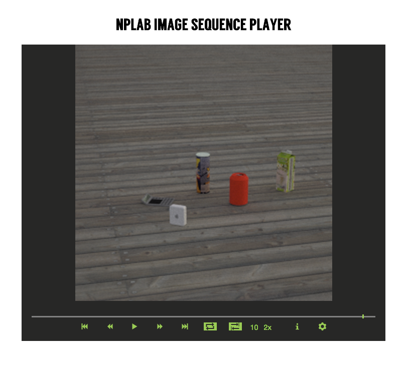

# NPLAB Image Sequence Player

A javascript based player for image sequences.

##Functions

* Goto Begin 
* Prev Frame 
* Play 
* Next Frame
* Goto End
* Repeat
* Play cycle(play forwrad and then play backward)
* Adjust fps
* Adjust scale/resolution
* Show/Hide overlays
* Show Image List
* Drag and Drop files to player

##Usage

In head part :

	<link rel="stylesheet" href="movie.css" type="text/css" /> 
	

	<link rel="stylesheet" href="player.css" type="text/css" /> 
	
	
In javascript part:

	$(document).ready(function() {
		$('#test_player').player();
	});

##Dependencies

[1]jquery 1.9.1

[2]jqueryui 1.9.2
